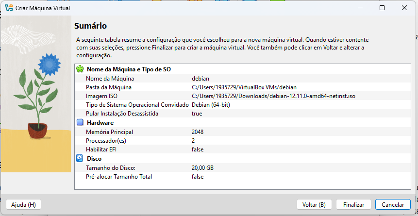
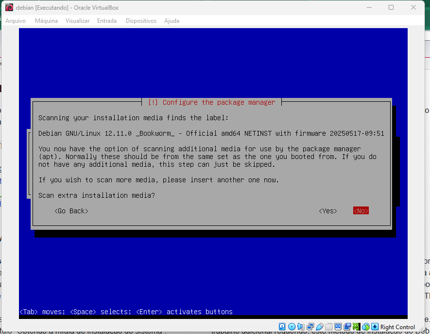

# Instalando o Debian no VirtualBox

Neste tutorial criaremos uma máquina virtual o VirtualBox e instalaremos do Debian sem interface gráfica, para uso na disciplina.

O primeiro passo é obter a imagem (ISO) do Debian no site [https://debian.org](https://debian.org).

Na sequência devemos abrir o VirtualBox.

Na tela inicial clicamos em *Novo*.

Definimos um nome para nossa máquina virtual. Neste tutorial usaremos `debian`. O VirtualBox já reconhece o nome e o tipo do sistema operacional. Caso ele não reconheça, selecione as opções corretas em *Tipo*, *Subtype* e *Versão*.

Agora você deve procurar a imagem ISO que foi baixada no início.

É importante **marcar** a opção *Pular Instalação Desassistida*. Caso isso não seja feito, não teremos controle sobre alguns detalhes da instalação que são importantes para a disciplina.

Aqui definimos a quantidade de memória e de processadores. Para nosso exemplo, vamos manter 2048MB de memória e vamos usar 2 processadores.

O tamanho do disco de armazenamento pode ser mantido em 20GB. Importante perceber que ele não vai ocupar todo de uma vez, esse é o limite até onde esse disco pode crescer.

O VirtualBox vai mostrar um resumo e você deve clicar em *Finalizar*.

Depois de criado, basta clicar em *Iniciar*.

Na primeira tela de instalação, devemos escolher a opção *Install*. Se não formos rápidos, o sistema entrará automaticamente na opção *Graphical Install* (Instalação gráfica), que **não** é o que queremos. Caso entre na instalação gráfica, basta reiniciar a máquina virtual.

Clique em *Continue* para que a máquina seja reiniciada.

A máquina virtual reiniciará e já está pronta para uso!

