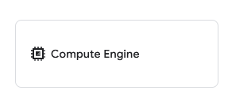
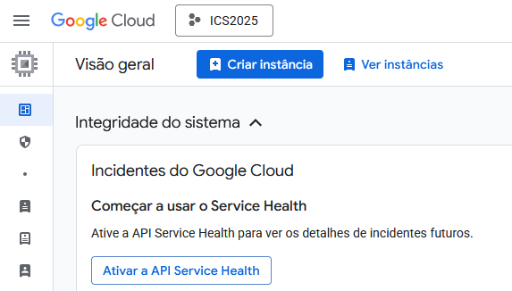
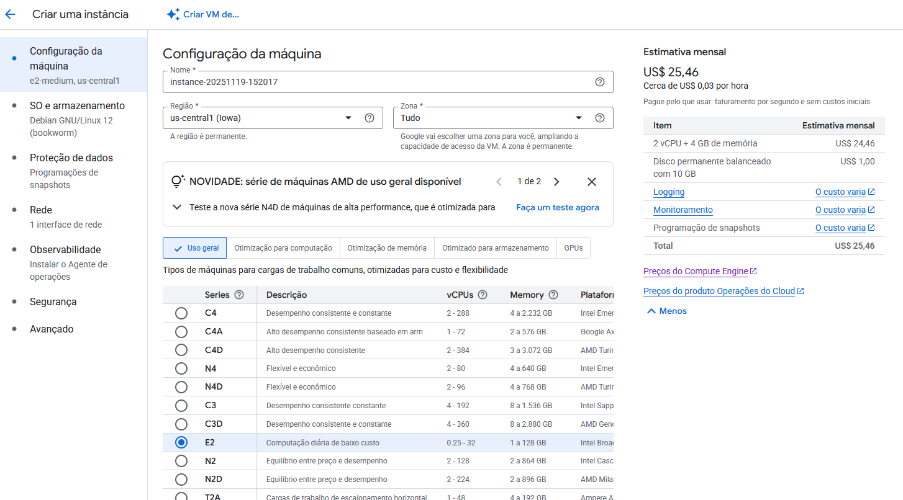
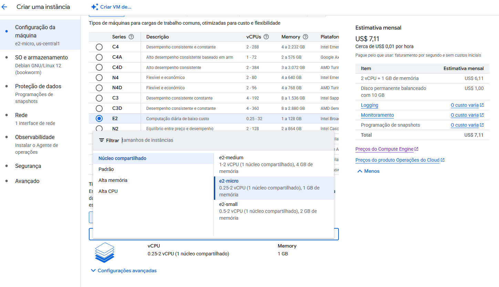
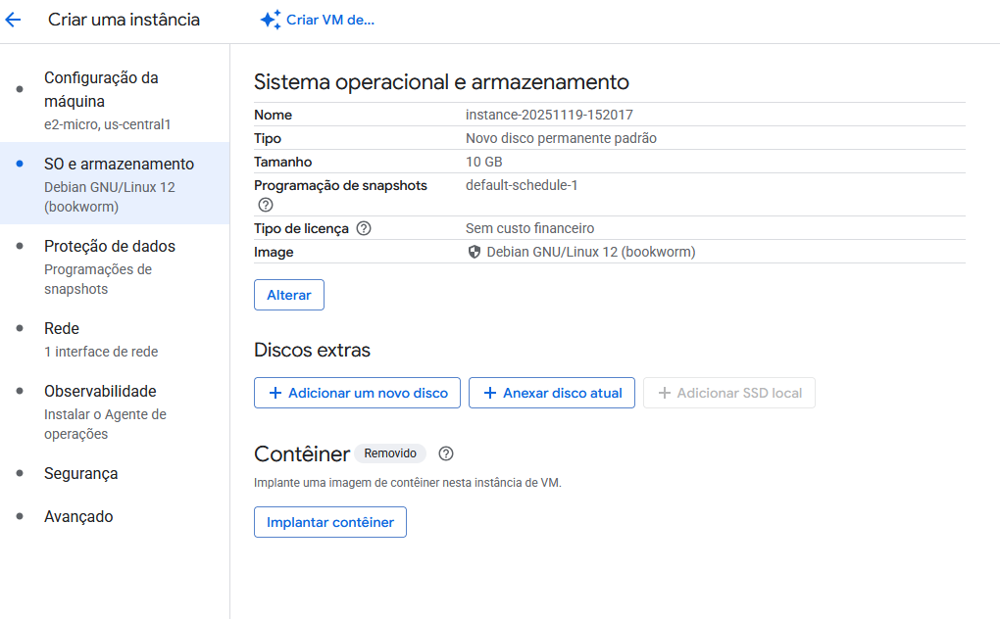
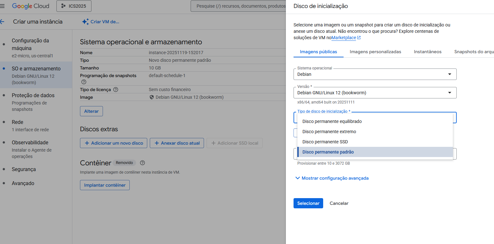
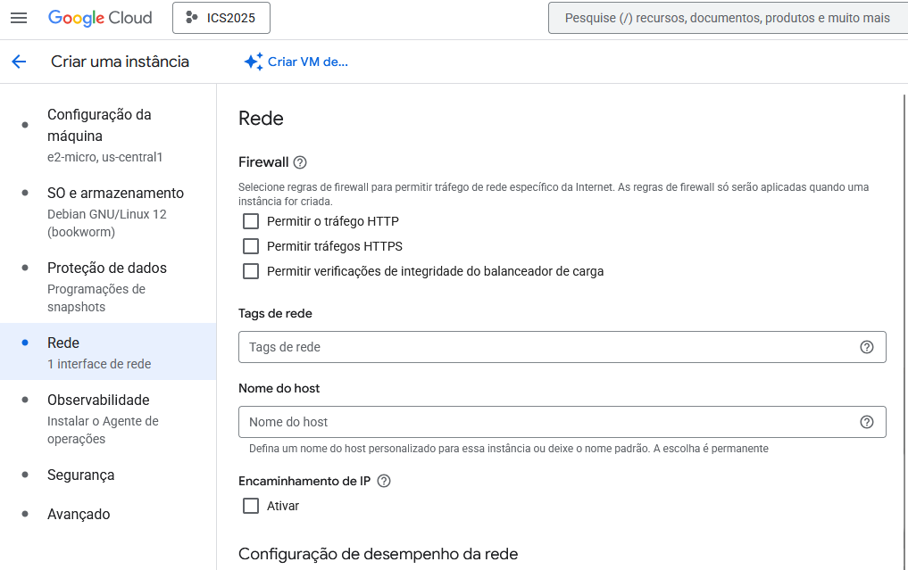
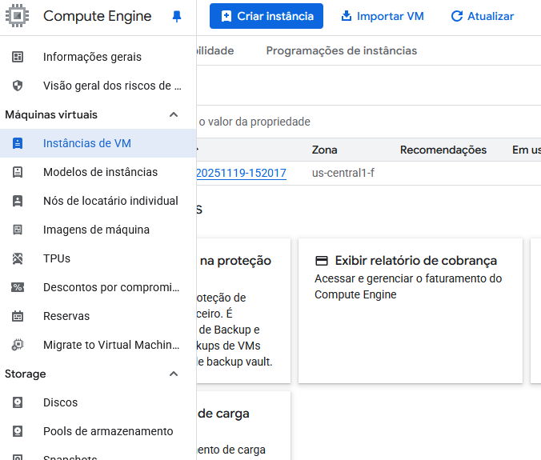
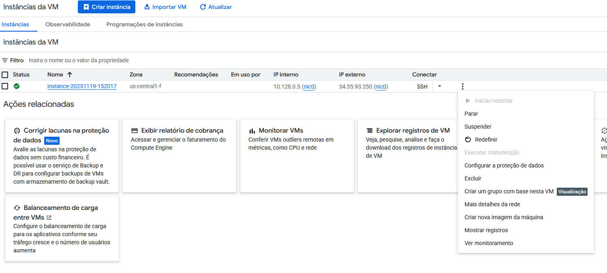

# Criação de Instância de VM no Google Cloud

O Google Cloud nos cedeu algumas contas com US$50 de crédito para uso dos seus serviços sem a necessidade de cadastro de cartão de crédito. Para resgatar os seus créditos, utilize o link e siga as instruções que foram compartilhadas no GSA.

Com sua conta de cobrança (escolar.ifrn.edu.br) e projeto criado, podemos criar novas instâncias de VM para uso na disciplina.

Acesse o console do GCloud em https://console.cloud.google.com

Busque o botão *Compute Engine* na seção de *Acesso rápido*:

Clique no botão *Criar instância*:

Defina um nome para a máquina (ou mantenha o padrão). Podemos manter também a Região e Zona sugerida. O tipo de máquina deve ser a **E2**, pois é mais barata e adequada para o que vamos fazer. 

Ainda assim a versão padrão da E2, ainda é muito cara, vamos buscar a opção mais barata rolando até o final da página e clicando escolhendo a predefinição **e2-micro**.

No menu do lado esquerdo, clicamos na opção *SO e armazenamento*. Confirmamos o uso do Debian/Linux. 

É possível economizar mais alguns centavos alterando o tipo do disco de inicialização em *Alterar* usando a opção *Disco permanente padrão*. Confirme clicando em selecionar.

Na aba *Rede* (menu do lado esquerdo) marcamos em *Firewall* as opções para **Permitir tráfego HTTP** e **Permitir tráfego HTTPS**.

As demais opções podemos deixar padrão e basta clicar em **Criar** no final da página.

A instância aparece na página de listagem de instâncias, acessada pela opção *Instâncias de VM* no menu do lado esquerdo.

Perceba que ela tem um IP interno e um IP externo. Esse IP externo é o que utilizaremos para acessar o servidor pelo navegador ou pelo terminal/ssh. É possível conectar diretamente pelo navegador, clicando no menu SSH, mas é preferível realizar a conexão em um cliente SSH nativo como o disponível no PowerShell.

No menu *mais ações* podemos desligar e apagar a VM.

!!! warning "Atenção!"
    Lembre-se de **desligar a VM sempre** após a aula ou quando não for usar. O Google Cloud cobra por tempo de execução e não podemos gastar todos os créditos antes do fim da disciplina.
    
    O custo apresentado quando criamos a VM é mensal, mas é importante economizar e deixar servidor ligado apenas quando realmente for necessário, por exemplo, para colocar os projetos integradores/TCCs no ar.
