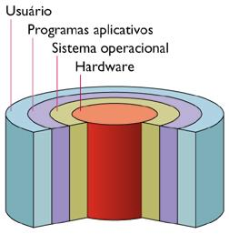

# <!-- fit --> Instalação e Configuração de Servidores

### Prof. Diego Cirilo

**Aula 01**: Apresentação da disciplina

---
# Objetivos
- Instalar um servidor de sistema operacional aberto e proprietário;
- Criar um usuário em um servidor de sistema operacional aberto e proprietário;
- Instalar serviços em um servidor de sistema operacional aberto e proprietário.

---
# Ementa
1. Instalando um sistema operacional proprietário
    1.1. Planejando a instalação
        1.1.1. Escolhendo o tipo do servidor
        1.1.2. Particionamento
        1.1.3. Executando a instalação
    1.2. Noções básicas de sistema
    1.3. Serviços de sistema

---
# Ementa
1.4. Instalação de serviços
    1.4.1. Instalação do servidor web
        1.4.1.1. Diretivas de configuração
        1.4.1.2. Publicação de sites
    1.4.2. Instalação do servidor do banco de dados
        1.4.2.1. Diretivas de configuração
        1.4.2.2. Criação de base de dados e usuário
        1.4.2.3. Atribuição de permissões

---
# Ementa
2. Instalando um sistema operacional aberto
    2.1. Planejando a instalação
        2.1.1. Particionamento
        2.1.2. Seleção de pacotes
        2.1.3. Executando a instalação
    2.2. Noções básicas de sistema
        2.2.1. Tipos de usuários 
        2.2.2. Utilização de terminal 
        2.2.3. Comandos de manipulação de arquivos 
        2.2.4. Edição de arquivos 
        2.2.5. Acesso remoto 

---
# Ementa
2.3. Instalação de pacotes 
2.4. Instalando o servidor web 
    2.4.1. Arquivos de configuração 
    2.4.2. Instalação de módulos 
    2.4.3. Publicando uma página web 
2.5. Instalando o servidor de banco de dados 
    2.5.1. Arquivos de configuração 
    2.5.2. Criação de base de dados e usuários 
    2.5.3. Atribuição de permissões 

---
# Procedimentos Metodológicos

- Aulas teóricas expositivas;
- Aulas práticas em laboratório;

---
# Avaliação
- Quiz (50pts)
- Avaliação Prática (50pts)

---
# <!-- fit --> Instalação e Configuração de Servidores

---
# Servidor
- Hardware/Software que disponibiliza funcionalidades para outros computadores ou programas;
- Hardware:
    - Mainframes
    - Servidores
- Normalmente o hardware fica localizado em um *datacenter* e o acesso é remoto.

---
# Hardware

---
# Hardware

---
# Servidor
- Na disciplina trataremos do software
- Sistema operacional
- Aplicações:
    - Servidor web
    - Servidor de email
    - Servidor de banco de dados
    - Servidor de jogos

---
# Sistemas Operacionais
- Definição: conjunto de softwares que gerenciam recursos de hardware e disponibilizam serviços básicos para outros softwares.

---
# Funções
- Estabelece uma interface com o usuário;
- Executa e oferece recursos para softwares aplicativos;
- Coordena os recursos de hardware do computador.

---
# Funções
- Gerenciamento da memória;
- Gestão do sistema de armazenamento de arquivos;
- Armazenamento de arquivos em uma estrutura hierárquica;
- Gestão e configuração de dispositivos;
- Drivers: programas que possibilitam a comunicação do sistema operacional com dispositivos de E/S.
    - *Plug and Play*;

---
# Funções
- Gestão e suporte a outros programas;
- Segurança do sistema;
- Controle da rede;
- Monitoramento do desempenho.

---
# Histórico
- Máquinas sem sistema operacional, tudo era feito "na mão";
- Surgimento dos primeiros *assemblers*;
- Compiladores;
- Bibliotecas - *Linkers*;
- Fila de trabalhos *física*;
- Monitoramento e auditoria automático do tempo de execução;

---
# Windows
- Sistema operacional da *Microsoft*;
- Código fechado;

---
# GNU/Linux
- Baseado no Unix;
- Criado por Linus Torvalds;
- Free and Open Source Software;
- Inúmeras "distribuições";
- [História do Unix](https://en.wikipedia.org/wiki/History_of_Unix#/media/File:Unix_history-simple.svg)

---
# GNU/Linux
- [Top 500 Server](https://www.top500.org/statistics/details/osfam/1/)
- [Uso de sistemas operacionais em servidores](https://w3techs.com/technologies/overview/operating_system)
- [Servidores web mais utilizados](https://w3techs.com/technologies/overview/web_server)
- [Uso geral de sistemas operacionais](https://gs.statcounter.com/os-market-share#monthly-202111-202210)
- [Resumo](https://en.wikipedia.org/wiki/Usage_share_of_operating_systems)

---
# <!--fit--> Dúvidas? 🤔
