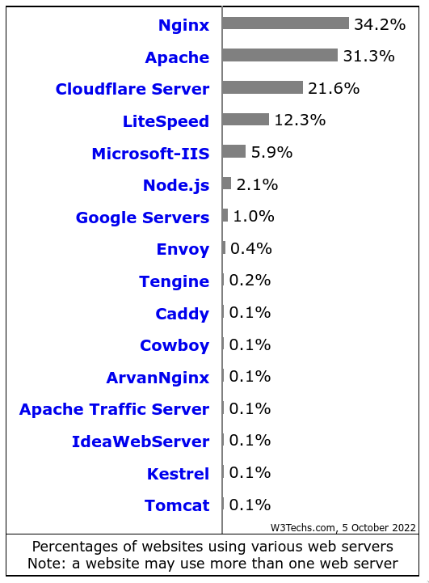

# Instalação e Configuração de Servidores - 2022.2
## Prof. Diego Cirilo
---
# Configuração de servidor Debian

- Primeiramente atualize o sistema e instale o sudo

```shell
$ su - 

# apt update
# apt full-upgrade
# apt install sudo

```
---
# Configuração do servidor Debian
- Para habilitar seu usuário para usar o sudo, utilize o comando visudo:
```shell
$ su -
# sudo visudo
```
---
# /etc/sudoers
```bash
#
# This file MUST be edited with the 'visudo' command as root.
#
# Please consider adding local content in /etc/sudoers.d/ instead of
# directly modifying this file.
#
# See the man page for details on how to write a sudoers file.
#
Defaults	env_reset
Defaults	mail_badpass
Defaults	secure_path="/usr/local/sbin:/usr/local/bin:/usr/sbin:/usr/bin:/sbin:/bin"

# Host alias specification

# User alias specification

# Cmnd alias specification

# User privilege specification
root	ALL=(ALL:ALL) ALL

# Allow members of group sudo to execute any command
%sudo	ALL=(ALL:ALL) ALL

# See sudoers(5) for more information on "@include" directives:

@includedir /etc/sudoers.d
```
---
# Servidor Apache2
<style>
img {
  display: block;
  margin: 0 auto;
}
</style>

---
# Instalação do Apache2
```shell
$ sudo apt update && sudo apt full-upgrade
$ sudo apt install apache2
```
---
# Configuração do Apache2

