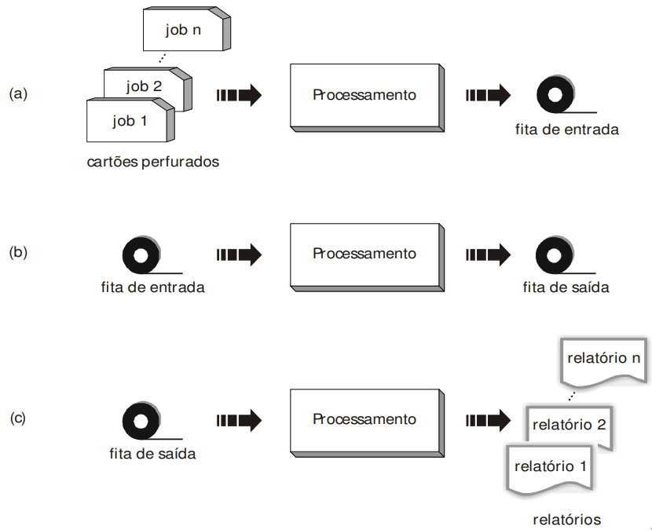
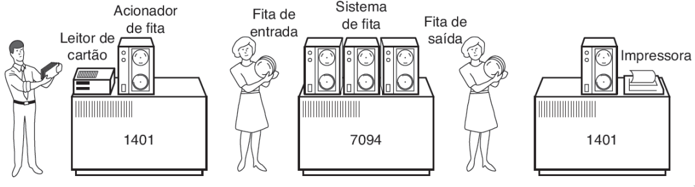
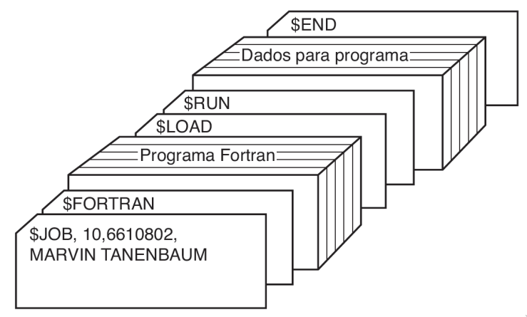

# <!-- fit --> Instalação e Configuração de Servidores

### Prof. Diego Cirilo

**Aula 02**: Sistemas Operacionais

---
# Sistema Batch

---
# Sistema Batch

---
# Sistema Batch

---
# GNU/Linux
- Baseado no Unix;
- Criado por Linus Torvalds em 1991;
- Junção dos utilitários desenvolvidos no projeto GNU (GNU's Not Unix) com o kernel Linux
- Free and Open Source Software;
- Inúmeras "distribuições";
- [História do Unix](https://en.wikipedia.org/wiki/History_of_Unix#/media/File:Unix_history-simple.svg)

---
# GNU/Linux
- [Top 500 Server](https://www.top500.org/statistics/details/osfam/1/)
- [Uso de sistemas operacionais em servidores](https://w3techs.com/technologies/overview/operating_system)
- [Servidores web mais utilizados](https://w3techs.com/technologies/overview/web_server)
- [Uso geral de sistemas operacionais](https://gs.statcounter.com/os-market-share#monthly-202111-202210)
- [Resumo](https://en.wikipedia.org/wiki/Usage_share_of_operating_systems)

---
# Arquitetura de um Sistema Operacional
- Kernel: núcleo do sistema, responsável pelo contato direto com o hardware e gerenciamento de processos.
- Shell: interface com o usuário (texto)
- Servidor gráfico
- Sistema de arquivos

---
# Exemplo DOS
- Sistema da Microsoft
- Ainda disponível

---
# Shell *"Unix"*
- Utilizado no MacOS, Linux, Unix.
- Vários tipos, o `bash` é o padrão na maioria.
- Bourne Again Shell
- csh, fish, zsh...

---
# Distribuições Linux
- Todos os componentes do sistema são intercambiáveis;
- Bom ou ruim?
- Primeiras versões eram apenas o código;
- Muitas opções são problemáticas;
- Responsabilidade para o usuário;
- Distribuições Linux.
 
---
# Distribuições Linux
- Grupo de pessoas ou organizações criam conjuntos de aplicativos e configurações padronizadas e que são testadas;
- Ex. Kernel + Shell (bash) + Interface gráfica + Aplicativos padrão
- Terminal, navegador, editor de textos, visualizador de imagens, gerenciador de rede, etc.
- Opções para todos os gostos;
- Uso geral, agnósticas e especializadas.

---
# Principais distribuições Linux
- LFS: *Linux From Scratch*
- Slackware, Gentoo, Debian, RedHat
- Ubuntu, Mint, Kali, Suse, CentOS
- Arch, Manjaro, Void, Artix
- [Evolução](https://upload.wikimedia.org/wikipedia/commons/8/8c/Linux_Distribution_Timeline_Dec._2020.svg)
- [DistroWatch](https://distrowatch.com/)

---
# Interfaces Gráficas
- XServer
- Wayland
- Gerenciadores de Janelas
    - Fluxbox, i3, dwm
- Ambientes de Desktop
    - Gnome, KDE, LXDE, Xfce

---
# Terminal
- xterm
- Gnome Terminal
- st
- konsole (KDE)

---
# Editor de textos/código
- nano
- vi/vim
- emacs
- gedit
- VSCode

---
# Gerenciadores de Pacotes
- Basicamente *appstores* do Linux
- Garantem que os programas instalados funcionam em conjunto
- Pacotes estão disponíveis em um repositório próprio de cada distro
- Ex. 
    - `apt`/`dpkg` (Debian, Ubuntu e afins)
    - `pacman` (Arch e afins)
    - `yum`/`rpm` (Red Hat, Fedora e afins)
    - ...
---
# Gerenciamento de pacotes
- Pacotes permitem a instalação mais rápida e ocupando menos espaço
- Componentes úteis em mais de uma aplicação são reutilizados
- Dependências
- Ex. bibliotecas
---
# <!--fit--> Dúvidas? 🤔
