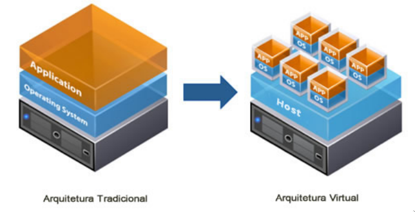
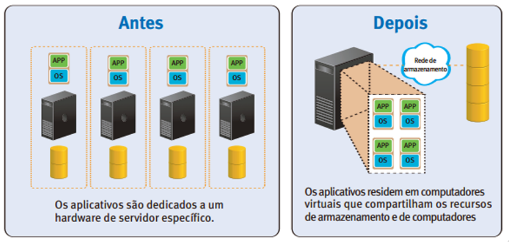
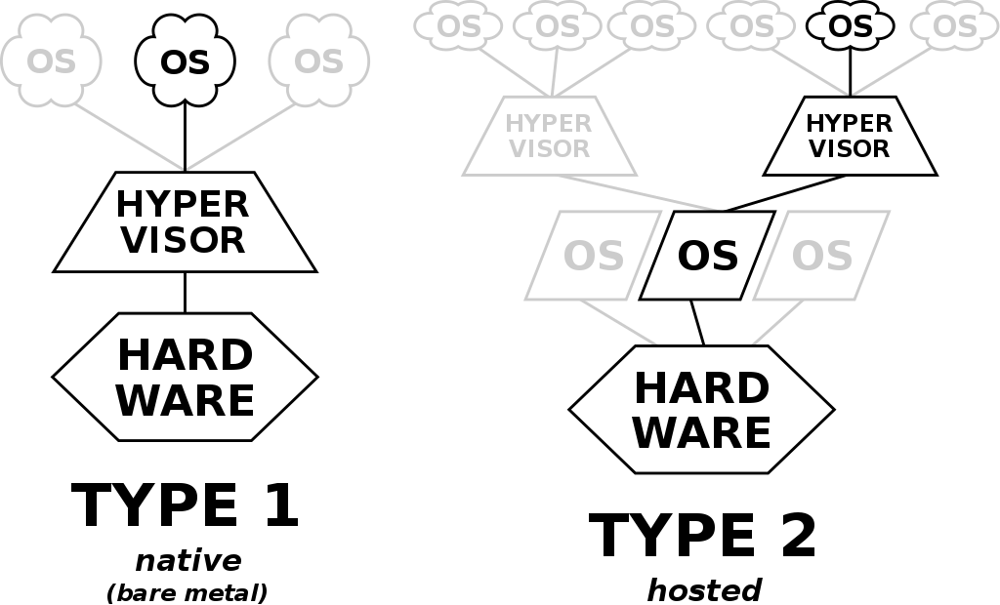

# <!-- fit --> Instalação e Configuração de Servidores

### Prof. Diego Cirilo

**Aula 05**: Virtualização

---
# Definição
> Emulação do hardware de "computadores" virtuais em software, independentes entre si, que compartilham um mesmo hardware de base.

---
# Motivação
- Custo;
- Eficiência;
- Eliminar ociosidade;
- Facilidade de manutenção;
- Reuso;
- Escalabilidade;

---
# Conceitos
- Host: máquina hospedeira, sistema físico;
- Guest: máquina "hóspede", máquina virtual ou VM;
- Hypervisor: sistema de supervisão da virtualização, gerencia as VMs

---

---

---
# Tipos de hypervisors:
- Bare-metal (tipo 1)
    - Executa diretamente sobre o hardware. 
    - Gerencia todos os SOs na máquina.
    - Mais eficiente em setups dedicados. Ex. datacenters.
    - Ex. Xen.
- Hosted (tipo 2)
    - Roda dentro de um SO convencional.
    - Mais conveniente em setups de uso geral.
    - Ex. VirtualBox, KVM, VMWare.

---

---
# Tipos de virtualização
- Completa
    - Um sistema virtual completo é criado, desde o BIOS/UEFI. Ex. Virtualbox, VMWare.
    - Apresenta um maior *overhead*.
- Paravirtualização
    - O sistema guest usa funções do SO Host. Exige sistemas operacionais específicos.

---
# Containers
- Isolamento virtual de bibliotecas e executáveis dentro de um SO base.
- Menor *overhead*
- Permite instalar diferentes versões de programas para seus projetos, sem alterar o SO Host.
- Facilita a portabilidade no desenvolvimento de aplicações.
- Ex. Docker.

---
# Virtualbox
- Hypervisor tipo 2;
- Virtualização completa;
- Desenvolvido pela Oracle;
- Open source;
- Roda em Windows, Linux e macOS;
- Será usado na disciplina.

---
# <!--fit--> Dúvidas? 🤔
