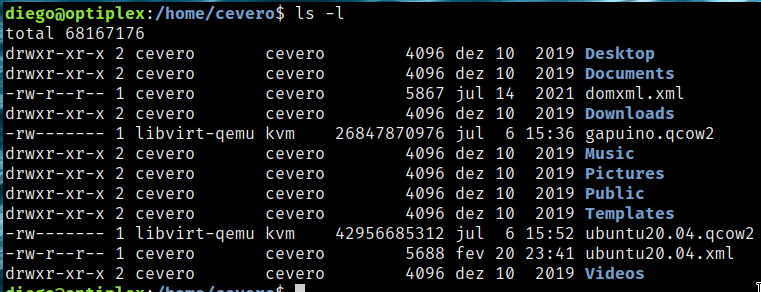

<style>
img {
  display: block;
  margin: 0 auto;
}
</style>

# <!-- fit --> Instalação e Configuração de Servidores

### Prof. Diego Cirilo

**Aula 07**: Usuários, Grupos e Permissões

---
# Usuários e Grupos
- Funcionalidade para gerenciamento de permissões de acesso
- Cada usuário pode pertencer a um ou mais grupos
- Quais grupos eu faço parte?
    - `groups`
- Os usuários ficam listados no arquivo `/etc/passwd`
- Os grupos ficam listados no arquivo `/etc/group`

---
# Permissões e propriedade
- Arquivos pertencem a um usuário e a um grupo
- No Linux/Unix *everything is a file*
- Usuários e grupos tem níveis de permissão para um arquivo:
    - `r` *read*
    - `w` *write*
    - `x` *execute*
- A ordem no `ls -l` é: dono, grupo e outros.

---
# Exemplo


---
<style scoped>section { font-size: 24px; }</style>
# Configurando permissões
- `chmod permissoes arquivos`
- As permissões podem ser no formato binário ou com letras.
- Binário
    - Os bits na ordem `rwx` convertidos para decimal.
    - Ex. `101` é 5, `100` é 4, etc.
    - Usamos um dígito para cada usuário, na ordem dono, grupo e outros.
    - Ex. "644", "777"
- Letras
    - Usamos `+` para adicionar e `-` para remover
    - `u` para o dono, `g` para o grupo e `o` para os outros. `a` para todos.
    - Ex. `a+x`, `go-x`, etc.

---
# Exercício
- Crie um diretório na sua `home` chamado `tarefa`
- Dentro desse diretório, crie 3 arquivos com as seguintes permissões:
    - `arq1`: o dono pode ler, escrever e executar, o grupo pode ler e executar, outros podem ler.
    - `arq2`: o dono pode ler e escrever, o grupo pode ler, outros não podem nada.
    - `arq3`: o dono pode ler e escrever, o grupo pode ler e escrever, outros podem ler e escrever.
- Verifique o resultado com `ls -l`

---
# Exercício
- Altere as permissões dos arquivos criados no exercício anterior:
    - `arq1`: remova a permissão de execução do dono e grupo.
    - `arq2`: adicione a permissão de escrita e execução para todos.
    - `arq3`: ninguém pode mais escrever.
- Verifique o resultado com `ls -l`

---
# Usuários

- Para criar um usuário usamos:
    - `# adduser nome`
- Para definir uma senha de usuário:
    - `# passwd nome`
- Uma *home* é criada para o novo usuário em `/home/nome`

---
# Usuários
- Para remover um usuário:
    - `# deluser nome`
- A *home* do usuário não é removida automaticamente.
- O comando `usermod` modifica informações do usuário.
- Para trocar de usuário (*select user*):
    - `$ su - nome`
    - `$ su -` para virar `root`
    - (entenda o `-` lendo o manual: `man su`)

---
# Grupos
- Permitem gerenciamento de acesso e permissões para conjuntos de usuários.
- Para criar novo grupo:
    - `# groupadd nome`
- Para remover grupo:
    - `# groupdel nome`
- Para editar grupo (ex. renomear):
    - `# groupmod -n novo velho`
- Adicionar usuário a um grupo:
    - `# usermod -aG grupo usuario`
- Remover usuário do grupo:
    - `# gpasswd --delete usuario grupo`

---
# `sudo`
- Os usuários por padrão não tem permissão de administrador
- O comando `sudo` permite que um usuário comum execute comandos como `root` temporariamente.
- Evita erros catastróficos.

---
# Configurando o `sudo`
- Vire *super user* com `su -` 
- Atualize o sistema e instale o pacote `sudo`

```shell
$ su - 

# apt update
# apt full-upgrade
# apt install sudo
```

---
# Configurando o `sudo`
- Provavelmente seu usuário não tem permissão de usar o `sudo`
- Saia do login de *root* (`exit`) e teste! Ex. `sudo apt update`
- Para configurar as permissões de `sudo` usamos o `visudo`

```shell
$ su -
# visudo
```

---
# /etc/sudoers

```bash
#
# This file MUST be edited with the 'visudo' command as root.
#
# Please consider adding local content in /etc/sudoers.d/ instead of
# directly modifying this file.
#
# See the man page for details on how to write a sudoers file.
#
Defaults	env_reset
Defaults	mail_badpass
Defaults	secure_path="/usr/local/sbin:/usr/local/bin:/usr/sbin:/usr/bin:/sbin:/bin"

# Host alias specification

# User alias specification

# Cmnd alias specification

# User privilege specification
root	ALL=(ALL:ALL) ALL

# Allow members of group sudo to execute any command
%sudo	ALL=(ALL:ALL) ALL

# See sudoers(5) for more information on "@include" directives:

@includedir /etc/sudoers.d
```

---
# `/etc/sudoers`

- **root** ALL=(ALL:ALL) ALL - Usuário ou grupo, se iniciar com `%`
- root **ALL**=(ALL:ALL) ALL - Em que hosts pode executar
- root ALL=(**ALL**:ALL) ALL - Como qual usuário
- root ALL=(ALL:**ALL**) ALL - Com qual grupo
- root ALL=(ALL:ALL) **ALL** - Quais comandos

---
# Entrando no grupo *sudo*

- Podemos criar permissões para nosso usuário ou entrar no grupo *sudo*
- Para entrar no grupo:
```shell
# usermod -aG sudo usuario
# exit
$ exit
```
- E fazemos login novamente para as mudanças terem efeito

---
# Verificando
- Verifique se faz parte do grupo com:
```shell
$ groups
```
- E teste:
```shell
$ sudo apt update
```
---
# Exercício
- Usando comandos com `sudo`:
    - Crie os usuários `visitante` e `john`
    - Defina a senha `1234` para os dois novos usuários.
    - Crie um grupo chamado `alunos`
    - Adicione `visitante` e `john` ao grupo alunos.
- Verifique em `/etc/group` e em `/etc/passwd` se deu certo.
- Saia do seu usuário e faça login como `john`.
- Saia do usuário `john`, faça login com seu usuário e remova `john`, `visitante` e o grupo `alunos`.
- Remova os diretórios dos usuários (`# rm -rf /home/usuario`). **CUIDADO**

---
# <!--fit--> Dúvidas? 🤔
