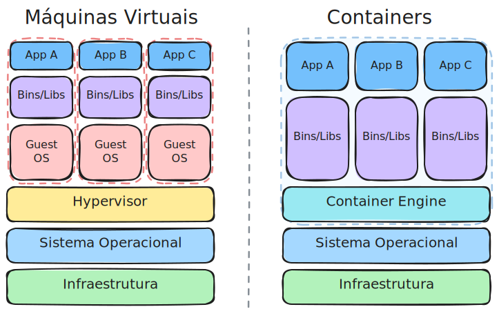
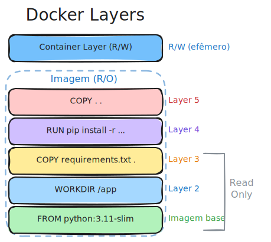

<style>
img, table {
  display: block;
  margin: 0 auto;
}
</style>

# <!-- fit --> Instalação e Configuração de Servidores

### Prof. Diego Cirilo

**Aula 14**: Conteinerização

---
# Conteinerização

- Tecnologia de virtualização em nível de sistema operacional
- Empacota aplicações e suas dependências em ambientes isolados
- Containers são leves, portáteis e consistentes
- Garante que o software funcione da mesma forma em qualquer ambiente

---
# Histórico

- 1979: `chroot` no Unix V7 - isolamento de diretórios
- 2000: FreeBSD Jails - containers completos
- 2004: Solaris Containers/Zones
- 2006: Process Containers (Google) - depois renomeado para cgroups
- 2008: LXC (Linux Containers) - primeira implementação completa no Linux
- 2013: Docker - popularizou containers tornando-os acessíveis

---
# Virtualização x Conteinerização



---
# Engines de Conteinerização

- **Docker**: engine mais popular e amplamente adotada
- **Podman**: alternativa sem daemon, mais segura
- **LXC/LXD**: containers de sistema completo
- **containerd**: runtime de containers (usado pelo Docker e Kubernetes)
- **CRI-O**: runtime para Kubernetes
- **rkt**: descontinuado em 2020

---
# Docker


- Criado por Solomon Hykes na dotCloud em 2013
- Open source desde o início
- Revolucionou o desenvolvimento e deploy de aplicações
- Baseado em tecnologias Linux: namespaces, cgroups, union filesystems
- Facilita criação, distribuição e execução de containers

---
# Por que Docker?

- **Portabilidade**: "funciona na minha máquina" → funciona em qualquer lugar
- **Consistência**: mesmo ambiente em dev, teste e produção
- **Eficiência**: usa recursos do sistema de forma otimizada
- **Isolamento**: aplicações isoladas em containers
- **Escalabilidade**: fácil de escalar horizontalmente
- **Versionamento**: imagens versionadas como código

---
# Conceitos Fundamentais

- **Imagem**: template read-only com o SO, aplicação e dependências
- **Container**: instância executável de uma imagem
- **Dockerfile**: arquivo de instruções para construir imagens
- **Registry**: repositório de imagens (Docker Hub, etc.)
- **Volume**: armazenamento persistente
- **Network**: rede para comunicação entre containers

---
# Instalação do Docker

No Debian/Ubuntu:

```bash
sudo apt update
sudo apt install docker.io docker-compose
sudo systemctl start docker
sudo systemctl enable docker
```

Adicionar usuário ao grupo docker:
```bash
sudo usermod -aG docker $USER
```
> Será necessário fazer logout e login novamente.

---
# Verificando a instalação

```bash
docker --version
docker run hello-world
```

Listar containers em execução:
```bash
docker ps
```

Listar todas as imagens:
```bash
docker images
```

---
# Dockerfile



- Arquivo de texto com instruções para construir uma imagem
- Cada instrução cria uma camada (*layer*) na imagem
- Sintaxe simples e declarativa
- Nome do arquivo: `Dockerfile` (sem extensão)

---
<style scoped>section { font-size: 22px; }</style>
# Instruções Principais do Dockerfile

- `FROM`: imagem base
- `RUN`: executa comandos durante o build
- `COPY`: copia arquivos do host para a imagem
- `ADD`: similar ao COPY, mas com funcionalidades extras
- `WORKDIR`: define diretório de trabalho
- `ENV`: define variáveis de ambiente
- `EXPOSE`: documenta portas expostas
- `CMD`: comando padrão ao executar o container
- `ENTRYPOINT`: comando principal do container

---
<style scoped>pre { font-size: 14px; }</style>
# Exemplo de Dockerfile

```dockerfile
# Imagem base
FROM python:3.11-slim

# Define diretório de trabalho
WORKDIR /app

# Copia arquivo de dependências
COPY requirements.txt .

# Instala dependências
RUN pip install --no-cache-dir -r requirements.txt

# Copia código da aplicação
COPY . .

# Expõe porta
EXPOSE 8000

# Comando para executar a aplicação
CMD ["python", "manage.py", "runserver", "0.0.0.0:8000"]
```

---
# Construindo uma Imagem

```bash
docker build -t nome-da-imagem:tag .
```

Exemplo:
```bash
docker build -t meu-app:1.0 .
```

O `.` indica o diretório atual como contexto de build.

---
# Executando um Container

```bash
docker run [opções] imagem [comando]
```

Opções comuns:
- `-d`: executa em background (detached)
- `-p`: mapeia portas (host:container)
- `-v`: monta volumes
- `--name`: define nome do container
- `-e`: define variáveis de ambiente
- `--rm`: remove container ao parar

---
# Exemplo de Execução

```bash
docker run -d \
  --name meu-app \
  -p 8000:8000 \
  -v $(pwd)/data:/app/data \
  -e DEBUG=False \
  meu-app:1.0
```

---
# Comandos Úteis

```bash
# Listar containers em execução
docker ps

# Listar todos os containers
docker ps -a

# Ver logs de um container
docker logs nome-container

# Executar comando em container
docker exec -it nome-container bash

# Parar container
docker stop nome-container

# Remover container
docker rm nome-container
```

---
# Docker Hub

- *Registry* público oficial do Docker
- Milhares de imagens oficiais e da comunidade
- Imagens oficiais: `python`, `nginx`, `postgres`, `node`, etc.
- URL: https://hub.docker.com

Baixar uma imagem:
```bash
docker pull python:3.11
```

---
# Enviando Imagens para o Docker Hub

```bash
# Login
docker login

# Tag da imagem
docker tag meu-app:1.0 usuario/meu-app:1.0

# Push
docker push usuario/meu-app:1.0
```

---
# Docker Compose


- Ferramenta para definir e executar aplicações multi-container
- Usa arquivo YAML para configuração
- Facilita orquestração de múltiplos serviços
- Ideal para ambientes de desenvolvimento e teste
- Nome do arquivo: `docker-compose.yml`

---
<style scoped>section { font-size: 22px; }</style>
# Estrutura do docker-compose.yml

```yaml
version: '3.8'

services:
  nome-servico:
    image: imagem:tag
    # ou
    build: ./diretorio
    ports:
      - "porta-host:porta-container"
    volumes:
      - ./local:/container
    environment:
      - VARIAVEL=valor
    depends_on:
      - outro-servico
```

---
# Comandos do Docker Compose

```bash
# Iniciar serviços
docker-compose up

# Iniciar em background
docker-compose up -d

# Parar serviços
docker-compose down

# Ver logs
docker-compose logs

# Reconstruir imagens
docker-compose build
```

---
# Tutorial: Django + PostgreSQL + Nginx

Vamos criar um deploy completo de uma aplicação Django usando:
- **Django**: framework web Python
- **PostgreSQL**: banco de dados
- **Gunicorn**: servidor WSGI
- **Nginx**: servidor web/proxy reverso

---
# Estrutura do Projeto

```
projeto/
├── django_app/
│   ├── manage.py
│   ├── requirements.txt
│   └── ...
├── nginx/
│   └── nginx.conf
├── docker-compose.yml
└── Dockerfile
```

---
<style scoped>pre { font-size: 13px; }</style>
# Dockerfile para Django

```dockerfile
FROM python:3.11-slim

# Evita perguntas durante instalação
ENV PYTHONDONTWRITEBYTECODE=1
ENV PYTHONUNBUFFERED=1

# Diretório de trabalho
WORKDIR /app

# Dependências do sistema
RUN apt-get update && apt-get install -y \
    postgresql-client \
    && rm -rf /var/lib/apt/lists/*

# Dependências Python
COPY requirements.txt .
RUN pip install --upgrade pip && \
    pip install --no-cache-dir -r requirements.txt

# Copia código
COPY . .

# Porta do Gunicorn
EXPOSE 8000

# Script de inicialização
COPY ./entrypoint.sh /entrypoint.sh
RUN chmod +x /entrypoint.sh

ENTRYPOINT ["/entrypoint.sh"]
```

---
<style scoped>pre { font-size: 14px; }</style>
# entrypoint.sh

```bash
#!/bin/bash

# Espera o PostgreSQL estar pronto
echo "Aguardando PostgreSQL..."
while ! nc -z db 5432; do
  sleep 0.1
done
echo "PostgreSQL iniciado"

# Executa migrations
python manage.py migrate --noinput

# Coleta arquivos estáticos
python manage.py collectstatic --noinput

# Inicia Gunicorn
exec gunicorn config.wsgi:application \
    --bind 0.0.0.0:8000 \
    --workers 3
```

---
<style scoped>pre { font-size: 14px; }</style>
# requirements.txt

```txt
Django>=4.2,<5.0
psycopg2-binary>=2.9
gunicorn>=21.0
python-dotenv>=1.0
```

Adicione outras dependências conforme necessário.

---
<style scoped>pre { font-size: 11px; }</style>
# docker-compose.yml (1/2)

```yaml
version: '3.8'

services:
  db:
    image: postgres:15
    container_name: django_db
    volumes:
      - postgres_data:/var/lib/postgresql/data
    environment:
      - POSTGRES_DB=django_db
      - POSTGRES_USER=django_user
      - POSTGRES_PASSWORD=senha_segura
    networks:
      - django_network

  web:
    build: .
    container_name: django_web
    command: gunicorn config.wsgi:application --bind 0.0.0.0:8000 --workers 3
    volumes:
      - .:/app
      - static_volume:/app/staticfiles
      - media_volume:/app/media
    environment:
      - DEBUG=False
      - SECRET_KEY=sua-chave-secreta-aqui
      - DATABASE_URL=postgresql://django_user:senha_segura@db:5432/django_db
```

---
<style scoped>pre { font-size: 11px; }</style>
# docker-compose.yml (2/2)

```yaml
    depends_on:
      - db
    networks:
      - django_network

  nginx:
    image: nginx:alpine
    container_name: django_nginx
    ports:
      - "80:80"
    volumes:
      - ./nginx/nginx.conf:/etc/nginx/nginx.conf:ro
      - static_volume:/app/staticfiles:ro
      - media_volume:/app/media:ro
    depends_on:
      - web
    networks:
      - django_network

volumes:
  postgres_data:
  static_volume:
  media_volume:

networks:
  django_network:
    driver: bridge
```

---
<style scoped>pre { font-size: 10px; }</style>
# nginx.conf

```nginx
events {
    worker_connections 1024;
}

http {
    include /etc/nginx/mime.types;
    default_type application/octet-stream;

    upstream django {
        server web:8000;
    }

    server {
        listen 80;
        server_name localhost;
        client_max_body_size 10M;

        location /static/ {
            alias /app/staticfiles/;
        }

        location /media/ {
            alias /app/media/;
        }

        location / {
            proxy_pass http://django;
            proxy_set_header Host $host;
            proxy_set_header X-Real-IP $remote_addr;
            proxy_set_header X-Forwarded-For $proxy_add_x_forwarded_for;
            proxy_set_header X-Forwarded-Proto $scheme;
        }
    }
}
```

---
<style scoped>section { font-size: 18px; }</style>
# Configuração do Django

No `settings.py`:

```python
import os
from pathlib import Path

# Database
DATABASES = {
    'default': {
        'ENGINE': 'django.db.backends.postgresql',
        'NAME': os.environ.get('POSTGRES_DB', 'django_db'),
        'USER': os.environ.get('POSTGRES_USER', 'django_user'),
        'PASSWORD': os.environ.get('POSTGRES_PASSWORD', 'senha_segura'),
        'HOST': os.environ.get('DB_HOST', 'db'),
        'PORT': os.environ.get('DB_PORT', '5432'),
    }
}

# Static files
STATIC_URL = '/static/'
STATIC_ROOT = BASE_DIR / 'staticfiles'

MEDIA_URL = '/media/'
MEDIA_ROOT = BASE_DIR / 'media'

# Security
ALLOWED_HOSTS = ['localhost', '127.0.0.1', '*']  # ajuste em produção
```

---
# Variáveis de Ambiente

Crie um arquivo `.env` na raiz do projeto:

```env
DEBUG=False
SECRET_KEY=chave-super-secreta-aqui
POSTGRES_DB=django_db
POSTGRES_USER=django_user
POSTGRES_PASSWORD=senha_segura
DB_HOST=db
DB_PORT=5432
```

> **IMPORTANTE**: Adicione `.env` ao `.gitignore`!

---
# Executando o Projeto

```bash
# Construir e iniciar containers
docker-compose up -d --build

# Ver logs
docker-compose logs -f

# Criar superusuário
docker-compose exec web python manage.py createsuperuser

# Acessar shell do Django
docker-compose exec web python manage.py shell
```

Acesse: http://localhost

---
# Comandos Úteis para Desenvolvimento

```bash
# Parar containers
docker-compose down

# Parar e remover volumes
docker-compose down -v

# Reconstruir apenas um serviço
docker-compose build web

# Ver status dos serviços
docker-compose ps

# Executar comando em serviço
docker-compose exec web python manage.py migrate
```

---
# Atualizando o Projeto

```bash
# Atualizar código e dependências
docker-compose down
docker-compose up -d --build

# Executar migrations
docker-compose exec web python manage.py migrate

# Coletar estáticos
docker-compose exec web python manage.py collectstatic --noinput
```

---
# Backup do Banco de Dados

```bash
# Criar backup
docker-compose exec db pg_dump -U django_user django_db > backup.sql

# Restaurar backup
docker-compose exec -T db psql -U django_user django_db < backup.sql
```

---
# Debug

Ver logs de um serviço específico:
```bash
docker-compose logs web
docker-compose logs db
docker-compose logs nginx
```

Acessar container:
```bash
docker-compose exec web bash
docker-compose exec db psql -U django_user django_db
```

---
# Boas Práticas

- Use `.dockerignore` para excluir arquivos desnecessários
- Não inclua `DEBUG=True` em produção
- Use variáveis de ambiente para configurações sensíveis
- Mantenha imagens leves usando imagens base slim/alpine
- Use volumes nomeados para dados persistentes
- Configure health checks para os containers
- Use multi-stage builds quando apropriado

---
# .dockerignore

```
*.pyc
__pycache__
*.pyo
*.pyd
.Python
env/
venv/
.venv/
.git
.gitignore
.dockerignore
*.md
.env
db.sqlite3
*.log
```

---
# Deploy em Produção

Considerações adicionais para produção:
- Use HTTPS com certificados SSL/TLS (Let's Encrypt)
- Configure firewall (UFW, iptables)
- Use secrets do Docker Swarm/Kubernetes para senhas
- Configure backup automatizado do banco
- Implemente monitoramento e logging
- Use um registry privado para imagens

---
# Plataformas de Deploy na Nuvem

- Principais provedores oferecem serviços para deploy de containers
- Eliminam a necessidade de gerenciar servidores
- Escalabilidade automática
- Modelo de pagamento por uso
- HTTPS automático

---
# Principais Plataformas


- **Google Cloud Run**: containers serverless, escala até zero
- **Azure Container Apps**: similar ao Cloud Run, integrado ao Azure
- **AWS App Runner**: deploy simplificado na AWS
- **AWS ECS/Fargate**: mais controle, maior complexidade
- **DigitalOcean App Platform**: simples e acessível
- **Fly.io**: fácil de usar, boa camada gratuita

---
<style scoped>section { font-size: 22px; }</style>
# Comparativo de Plataformas

| Plataforma | Escala p/ Zero | Preço Inicial | Complexidade |
|------------|----------------|---------------|--------------|
| Cloud Run | Sim | Gratuito* | Baixa |
| Azure Container Apps | Sim | Gratuito* | Baixa |
| AWS App Runner | Não | ~$5/mês | Baixa |
| DigitalOcean | Não | $5/mês | Baixa |
| Fly.io | Sim | Gratuito* | Baixa |

*Camada gratuita com limites

---
# Google Cloud Run


- Serviço serverless para executar containers
- Escala automaticamente de 0 a N instâncias
- Paga apenas pelo tempo de execução
- Suporta qualquer linguagem/framework
- HTTPS automático
- Camada gratuita generosa

---
# Pré-requisitos para Cloud Run

- Conta no Google Cloud (https://cloud.google.com)
- Projeto criado no Google Cloud Console
- Google Cloud CLI (`gcloud`) instalado
- Docker instalado localmente

---
# Instalando o Google Cloud CLI

No Linux:
```bash
curl https://sdk.cloud.google.com | bash
exec -l $SHELL
gcloud init
```

No Windows, baixe o instalador em:
https://cloud.google.com/sdk/docs/install

---
# Configuração Inicial

```bash
# Login na conta Google
gcloud auth login

# Configurar projeto
gcloud config set project SEU_PROJECT_ID

# Habilitar APIs necessárias
gcloud services enable run.googleapis.com
gcloud services enable cloudbuild.googleapis.com
```

---
# Tutorial: Django no Cloud Run

Estrutura do projeto:
```
projeto/
├── config/
│   ├── settings.py
│   └── wsgi.py
├── app/
├── manage.py
├── requirements.txt
├── Dockerfile
└── .dockerignore
```

---
<style scoped>pre { font-size: 13px; }</style>
# Dockerfile para Cloud Run

```dockerfile
FROM python:3.11-slim

ENV PYTHONDONTWRITEBYTECODE=1
ENV PYTHONUNBUFFERED=1
ENV PORT=8080

WORKDIR /app

# Dependências Python
COPY requirements.txt .
RUN pip install --upgrade pip && \
    pip install --no-cache-dir -r requirements.txt

# Copia código
COPY . .

# Coleta arquivos estáticos
RUN python manage.py collectstatic --noinput

# Cloud Run usa a variável PORT
CMD exec gunicorn --bind :$PORT --workers 2 config.wsgi:application
```

---
# requirements.txt

```txt
Django>=4.2,<5.0
gunicorn>=21.0
```

Adicione outras dependências conforme necessário.

---
<style scoped>section { font-size: 20px; }</style>
# Configuração do Django para Cloud Run

No `settings.py`:

```python
import os

DEBUG = os.environ.get('DEBUG', 'False') == 'True'
SECRET_KEY = os.environ.get('SECRET_KEY', 'chave-desenvolvimento')

ALLOWED_HOSTS = ['*']

# Configurações de segurança para HTTPS
SECURE_PROXY_SSL_HEADER = ('HTTP_X_FORWARDED_PROTO', 'https')

# Arquivos estáticos
STATIC_URL = '/static/'
STATIC_ROOT = BASE_DIR / 'staticfiles'
```

---
# Deploy no Cloud Run

Build e deploy em um único comando:
```bash
gcloud run deploy django-app \
    --source . \
    --region southamerica-east1 \
    --allow-unauthenticated
```

O comando irá:
1. Fazer build da imagem usando Cloud Build
2. Enviar para o Container Registry
3. Fazer deploy no Cloud Run

---
# Deploy com Variáveis de Ambiente

```bash
gcloud run deploy django-app \
    --source . \
    --region southamerica-east1 \
    --allow-unauthenticated \
    --set-env-vars "DEBUG=False" \
    --set-env-vars "SECRET_KEY=sua-chave-secreta"
```

---
# Atualizando o Deploy

Após modificações no código:

```bash
gcloud run deploy django-app \
    --source . \
    --region southamerica-east1
```

O Cloud Run mantém as configurações anteriores.

---
# Comandos Úteis

```bash
# Listar serviços
gcloud run services list

# Ver detalhes do serviço
gcloud run services describe django-app \
    --region southamerica-east1

# Ver logs
gcloud run services logs read django-app \
    --region southamerica-east1

# Deletar serviço
gcloud run services delete django-app \
    --region southamerica-east1
```

---
# Domínio Personalizado

```bash
# Mapear domínio
gcloud run domain-mappings create \
    --service django-app \
    --domain meusite.com.br \
    --region southamerica-east1
```

Configure os registros DNS conforme instruções.
O certificado SSL é gerado automaticamente.

---
# Custos do Cloud Run

- **Camada gratuita**: 2 milhões de requisições/mês
- **CPU**: cobrado por segundo de uso
- **Memória**: cobrado por segundo de uso
- **Escala para zero**: não cobra quando inativo

Para projetos pequenos, o custo pode ser zero.

---
# Alternativas e Próximos Passos

- **Docker Swarm**: orquestração nativa do Docker
- **Kubernetes/GKE**: orquestração avançada de containers
- **Portainer**: interface gráfica para gerenciar Docker
- **Traefik**: proxy reverso com suporte a containers
- **CI/CD**: integração com GitHub Actions, GitLab CI, etc.

---
# Referências

- https://docs.docker.com/
- https://docs.docker.com/compose/
- https://hub.docker.com/
- https://cloud.google.com/run/docs
- https://azure.microsoft.com/pt-br/products/container-apps
- https://docs.djangoproject.com/en/5.0/howto/deployment/
- https://gunicorn.org/
- https://nginx.org/en/docs/

---
# <!--fit--> Dúvidas? 🤔
