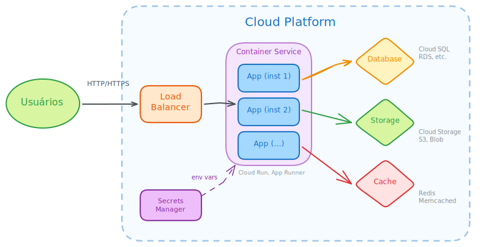

<style>
img, table {
  display: block;
  margin: 0 auto;
}
</style>

# <!-- fit --> Instalação e Configuração de Servidores

### Prof. Diego Cirilo

**Aula 14**: Conteinerização

---
# Conteinerização

- Tecnologia de virtualização em nível de sistema operacional
- Empacota aplicações e suas dependências em ambientes isolados
- Containers são leves, portáteis e consistentes
- Garante que o software funcione da mesma forma em qualquer ambiente

---
# Histórico

- 1979: `chroot` no Unix V7 - isolamento de diretórios
- 2000: FreeBSD Jails - containers completos
- 2004: Solaris Containers/Zones
- 2006: Process Containers (Google) - depois renomeado para cgroups
- 2008: LXC (Linux Containers) - primeira implementação completa no Linux
- 2013: Docker - popularizou containers tornando-os acessíveis

---
# Virtualização x Conteinerização


---
# Engines de Conteinerização

- **Docker**: engine mais popular e amplamente adotada
- **Podman**: alternativa sem daemon, mais segura
- **LXC/LXD**: containers de sistema completo
- **containerd**: runtime de containers (usado pelo Docker e Kubernetes)

---
<style scoped>section { font-size: 26px; }</style>
# Docker


- Criado por Solomon Hykes na dotCloud em 2013
- Open source desde o início
- Revolucionou o desenvolvimento e deploy de aplicações
- Baseado em tecnologias Linux: namespaces, cgroups, union filesystems
- Facilita criação, distribuição e execução de containers

---
# Por que Docker?

- **Portabilidade**: "funciona na minha máquina" → funciona em qualquer lugar
- **Consistência**: mesmo ambiente em dev, teste e produção
- **Eficiência**: usa recursos do sistema de forma otimizada
- **Isolamento**: aplicações isoladas em containers
- **Escalabilidade**: fácil de escalar horizontalmente
- **Versionamento**: imagens versionadas como código

---
# Conceitos Fundamentais

- **Imagem**: template read-only com o SO, aplicação e dependências
- **Container**: instância executável de uma imagem
- **Dockerfile**: arquivo de instruções para construir imagens
- **Registry**: repositório de imagens (Docker Hub, etc.)
- **Volume**: armazenamento persistente
- **Network**: rede para comunicação entre containers

---
# Instalação do Docker no Debian/Ubuntu

- [Documentação oficial](https://docs.docker.com/engine/install/debian/)

Adicionar usuário ao grupo docker:
```bash
sudo usermod -aG docker $USER
```
> Será necessário fazer logout e login novamente.

---
# Verificando a instalação

```bash
docker --version
docker run hello-world
```

Listar containers em execução:
```bash
docker ps
```

Listar todos os containers:
```bash
docker ps -a
```

Listar todas as imagens:
```bash
docker images
```

---
<style scoped>section { font-size: 24px; }</style>
# Dockerfile


- Arquivo de texto com instruções para construir uma imagem
- Cada instrução cria uma camada (*layer*) na imagem
- Sintaxe simples e declarativa
- Nome do arquivo: `Dockerfile` (sem extensão)
- Normalmente versionado junto com o projeto

---
<style scoped>section { font-size: 28px; }</style>
# Instruções Principais do Dockerfile

- `FROM`: imagem base
- `RUN`: executa comandos durante o build
- `COPY`: copia arquivos do host para a imagem
- `ADD`: similar ao COPY, mas com funcionalidades extras
- `WORKDIR`: define diretório de trabalho
- `ENV`: define variáveis de ambiente
- `EXPOSE`: documenta portas expostas
- `CMD`: comando padrão ao executar o container
- `ENTRYPOINT`: comando principal do container

---
<style scoped>pre { font-size: 20px; }</style>
# Exemplo de Dockerfile

```dockerfile
# Imagem base
FROM python:3.11-slim

# Define diretório de trabalho
WORKDIR /app

# Copia arquivo de dependências
COPY requirements.txt .

# Instala dependências
RUN pip install --no-cache-dir -r requirements.txt

# Copia código da aplicação
COPY . .

# Expõe porta
EXPOSE 8000

# Comando para executar a aplicação
CMD ["python", "manage.py", "runserver", "0.0.0.0:8000"]
```

---
# Construindo uma Imagem

```bash
docker build -t nome-da-imagem:tag .
```

Exemplo:
```bash
docker build -t meu-app:1.0 .
```

O `.` indica o diretório atual como contexto de build.

---
# Executando um Container

```bash
docker run [opções] imagem [comando]
```

Opções comuns:
- `-d`: executa em background (detached)
- `-p`: mapeia portas (host:container)
- `-v`: monta volumes
- `--name`: define nome do container
- `-e`: define variáveis de ambiente
- `--rm`: remove container ao parar

---
# Exemplo de Execução

```bash
docker run -d \
  --name meu-app \
  -p 8000:8000 \
  -v $(pwd)/data:/app/data \
  -e DEBUG=False \
  meu-app:1.0
```

---
# Comandos Úteis

```bash
# Listar containers em execução
docker ps

# Listar todos os containers
docker ps -a

# Ver logs de um container
docker logs nome-container

# Executar comando em container
docker exec -it nome-container bash

# Parar container
docker stop nome-container

# Remover container
docker rm nome-container
```

---
# Docker Hub

- *Registry* público oficial do Docker
- Milhares de imagens oficiais e da comunidade
- Imagens oficiais: `python`, `nginx`, `postgres`, `node`, etc.
- URL: https://hub.docker.com

Baixar uma imagem:
```bash
docker pull python:3.11
```

---
# Enviando Imagens para o Docker Hub

```bash
# Login
docker login

# Tag da imagem
docker tag meu-app:1.0 usuario/meu-app:1.0

# Push
docker push usuario/meu-app:1.0
```

---
<style scoped>section { font-size: 24px; }</style>
# Docker Compose


- Ferramenta para definir e executar aplicações multi-container
- Usa arquivo YAML para configuração
- Facilita orquestração de múltiplos serviços
- Ideal para ambientes de desenvolvimento e teste
- Nome do arquivo: `docker-compose.yml`
- Normalmente versionado junto com o código

---
# Estrutura do docker-compose.yml

- **version**: versão da especificação (desnecessário em versões recentes)
- **services**: define os containers da aplicação
- **volumes**: armazenamento persistente
- **networks**: redes para comunicação entre containers
- **secrets**: dados sensíveis (senhas, chaves)
- **configs**: arquivos de configuração

---
# Definindo Services

```yaml
services:
  nome-do-servico:
    image: imagem:tag        # imagem do Docker Hub
    build: ./diretorio       # ou build local
    container_name: nome     # nome fixo do container
    ports:
      - "8080:80"            # host:container
    volumes:
      - ./local:/container   # bind mount
      - dados:/app/data      # volume nomeado
    environment:
      - VARIAVEL=valor
    depends_on:
      - outro-servico
    restart: unless-stopped
```

---
# Opção `build`

```yaml
services:
  web:
    # Build simples
    build: .

    # Build com opções
    build:
      context: ./app
      dockerfile: Dockerfile.prod
      args:
        - ENV=production
```

---
# Opção `ports`

```yaml
services:
  web:
    ports:
      # porta_host:porta_container
      - "8080:80"

      # apenas porta do container (host aleatória)
      - "80"

      # especificando IP do host
      - "127.0.0.1:8080:80"

      # protocolo UDP
      - "53:53/udp"
```

---
# Opção `environment`

```yaml
services:
  web:
    # Lista de variáveis
    environment:
      - DEBUG=false
      - SECRET_KEY=chave123

    # Ou formato de mapa
    environment:
      DEBUG: "false"
      SECRET_KEY: chave123

    # Arquivo externo
    env_file:
      - .env
      - .env.local
```

---
# Opção `depends_on`

```yaml
services:
  web:
    depends_on:
      - db
      - redis

  db:
    image: postgres:15

  redis:
    image: redis:alpine
```

> **Atenção**: `depends_on` garante ordem de início, mas não que o serviço esteja pronto para receber conexões.

---
# Opção `restart`

```yaml
services:
  web:
    restart: unless-stopped
```

Opções:
- `no`: não reinicia automaticamente (padrão)
- `always`: sempre reinicia
- `on-failure`: reinicia apenas em caso de erro
- `unless-stopped`: reinicia exceto se parado manualmente

---
<style scoped>section { font-size: 26px; }</style>
# Bind Mounts vs. Volumes Nomeados

- **Bind Mounts** (`./codigo:/app`)
    - Mapeia diretório/arquivo do **host** para o container
    - Caminho do host especificado diretamente (começa com `./` ou `/`)
    - Útil para **desenvolvimento**: edita no host, reflete no container

- **Volumes Nomeados** (`dados:/app/data`)
    - Gerenciados pelo Docker (em `/var/lib/docker/volumes/`)
    - Mais portátil e seguro
    - Ideal para **dados persistentes**: bancos de dados, uploads

---
<style scoped>pre { font-size: 24px; }</style>
# Volumes no Compose

```yaml
services:
  web:
    volumes:
      - ./codigo:/app           # bind mount
      - dados:/var/lib/dados    # volume nomeado
  db:
    volumes:
      - postgres_data:/var/lib/postgresql/data

volumes:
  dados:
  postgres_data:
  dados_externos:
    external: true              # volume já existente
```

---
<style scoped>pre { font-size: 24px; }</style>
# Networks

```yaml
services:
  web:
    networks:
      - frontend
      - backend

  db:
    networks:
      - backend

networks:
  frontend:
  backend:
    internal: true    # sem acesso externo
```

> Containers na mesma rede se comunicam pelo nome do serviço.

---
# Comandos do Docker Compose

```bash
# Iniciar serviços (em foreground / em background)
docker compose up
docker compose up -d

# Reconstruir e iniciar
docker compose up -d --build

# Parar serviços / parar e remover volumes
docker compose down
docker compose down -v

# Ver serviços e logs
docker compose ps
docker compose logs -f web
```

---
# Gerenciamento

```bash
# Executar comando em container rodando
docker compose exec web python manage.py migrate
docker compose exec web bash

# Executar em container único (sem serviço rodando)
docker compose run web python manage.py createsuperuser

# Parar/iniciar/reiniciar serviços
docker compose stop
docker compose start
docker compose restart web

# Escalar serviços
docker compose up -d --scale web=3
```

---
# Variáveis de Ambiente no Compose

```yaml
# docker-compose.yml
services:
  db:
    environment:
      - POSTGRES_DB=${POSTGRES_DB}
      - POSTGRES_USER=${POSTGRES_USER}
      - POSTGRES_PASSWORD=${POSTGRES_PASSWORD}
```

```bash
# .env
POSTGRES_DB=meu_banco
POSTGRES_USER=usuario
POSTGRES_PASSWORD=senha_segura
```

---
# Health Checks

```yaml
services:
  web:
    healthcheck:
      test: ["CMD", "curl", "-f", "http://localhost:8000/health"]
      interval: 30s
      timeout: 10s
      retries: 3
      start_period: 40s
```

Permite verificar se o serviço está realmente pronto.

---
# Boas Práticas

- Use `.env` para variáveis de ambiente sensíveis
- Adicione `.env` ao `.gitignore`
- Use volumes nomeados para dados persistentes
- Use `restart: unless-stopped` para produção
- Defina networks explícitas para isolar serviços
- Use health checks para dependências reais
- Mantenha o arquivo organizado e comentado

---
<style scoped>pre { font-size: 20px; }</style>
# .dockerignore

```
*.pyc
__pycache__
*.pyo
*.pyd
.Python
env/
venv/
.venv/
.git
.gitignore
.dockerignore
*.md
.env
db.sqlite3
*.log
```

> Reduz o contexto de build e evita enviar arquivos sensíveis.

---
# Deploy de Containers na Nuvem

- Principais provedores oferecem serviços para deploy de containers
- Eliminam a necessidade de gerenciar servidores
- Escalabilidade automática
- Modelo de pagamento por uso
- HTTPS automático e domínios personalizados

---
# Principais Plataformas


- Google Cloud Run
- Azure Container Apps
- AWS App Runner
- DigitalOcean App Platform

---
# Como Funciona o Deploy

- Criar conta no provedor de nuvem
- Configurar projeto/aplicação
- Fazer build da imagem Docker (local ou na nuvem)
- Enviar imagem para o registry do provedor
- Configurar variáveis de ambiente
- Deploy via CLI ou interface web

---
<style scoped>section { font-size: 24px; }</style>
# Serviços Gerenciados Integrados

- **Banco de Dados**: Cloud SQL (GCP), Azure Database, RDS (AWS)
- **Storage**: Cloud Storage, Azure Blob, S3
- **Cache**: Memorystore, Azure Cache, ElastiCache
- **Filas**: Pub/Sub, Service Bus, SQS
- **Secrets**: Secret Manager para senhas e chaves
- Aplicação acessa esses serviços via variáveis de ambiente

---
# Arquitetura na Nuvem



---
# Vantagens do Deploy na Nuvem

- **Sem gerenciamento de servidores**: foco no código
- **Escalabilidade**: ajusta recursos conforme demanda
- **Alta disponibilidade**: redundância automática
- **Segurança**: HTTPS, firewalls, IAM integrados
- **Monitoramento**: logs e métricas centralizados
- **CI/CD**: integração com GitHub, GitLab, etc.

---
# Considerações

- **Custo**: pode escalar rapidamente com uso intenso
- **Vendor lock-in**: migração entre provedores pode ser complexa
- **Latência**: escolher região próxima aos usuários
- **Limites**: cada plataforma tem limites de tempo, memória, etc.
- **Complexidade**: serviços gerenciados adicionam configuração

---
# Sugestão de estudo

- **Docker Swarm**: orquestração nativa do Docker
- **Kubernetes**: orquestração avançada de containers
- **Portainer**: interface gráfica para gerenciar Docker
- **Traefik**: proxy reverso com suporte a containers
- **CI/CD**: integração com GitHub Actions, GitLab CI

---
# Referências

- https://docs.docker.com/
- https://docs.docker.com/compose/
- https://hub.docker.com/
- https://cloud.google.com/run/docs
- https://azure.microsoft.com/pt-br/products/container-apps
- https://aws.amazon.com/pt/apprunner/

---
# <!--fit--> Dúvidas? 🤔
